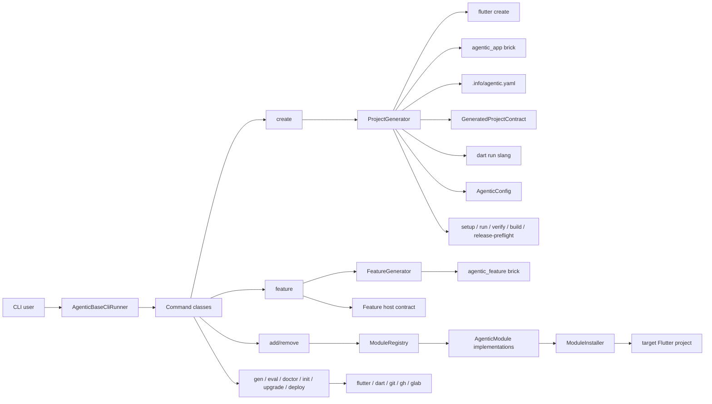

# 04. System Architecture

## Overview

`agentic_base` is a generator package, not an app runtime. The repo architecture centers on a command-line control plane that resolves a manager-aware Flutter/Dart toolchain, shells out through that resolved executable path, applies Mason templates, and mutates target-project files in a controlled way so generated repos have one canonical context contract and deterministic execution surfaces. Preview-only `--dry-run` paths now report the planned reads, writes, and commands without probing toolchains or mutating projects. The current local-first observability wave extends that same control plane with structured runtime telemetry files and a derived inspect surface, not with a hosted console.

## Main Layers

### 1. CLI Layer

Files under `lib/src/cli/` define the user-facing contract:

- `cli_runner.dart` wires the command catalog
- command files validate input, choose the right workflow, and translate failures into exit codes
- commands that touch external tools now expose truthful `--dry-run` previews instead of fake logging

This layer should stay user-facing and thin, though some command files currently carry too much orchestration.

### 2. Generator Layer

Files under `lib/src/generators/` own scaffold workflows:

- `ProjectGenerator` handles fresh app creation
- `FeatureGenerator` applies feature bricks
- `FeatureHostSynchronizer` wires full feature specs into host routes and spec-contract tests
- `TestGenerator` turns a feature spec into test stubs

`ProjectGenerator` is the central create-flow orchestrator. `AgenticAppSurfaceSynchronizer` is the shared surface materializer for `create`, `init`, and `upgrade`. Together they call native tooling, overlay templates, sync generator-owned surfaces, install modules, apply ownership cleanup, materialize typed translations, then verify the generated project contract through the generated harness scripts. Fresh creates default to full verification, while CI can opt into `--verify-mode none` only when it immediately runs another generated gate.

### 3. Project State Layer

Files under `lib/src/config/` define repo-managed state:

- `AgenticConfig` reads and writes `.info/agentic.yaml`
- `ProjectMetadata`, `HarnessMetadata`, and `FlutterSdkContract` define the typed machine contract, including preferred-vs-resolved SDK state
- `InitProjectMetadataResolver` infers repair-time metadata from an existing Flutter repo
- `resolveFlutterToolchain(...)` centralizes fallback order and command-shape resolution for Flutter and Dart subprocesses
- dry-run previews reuse the declared manager contract and intentionally skip toolchain probing, while real execution still falls back through preferred, inferred, then system toolchains
- `SpecParser` parses `feature.spec.yaml`
- `StateConfig` maps supported state-management choices to dependencies

This layer is the package memory for generated projects.

### 4. Module Layer

Files under `lib/src/modules/` define installable capabilities:

- `AgenticModule` is the contract
- `ModuleRegistry` is the inventory plus dependency/conflict resolver
- `ModuleInstaller` performs file and YAML mutations through a repo-owned dependency catalog
- concrete modules generate service contracts, runtime wiring, bootstrap init hooks, and manual platform instructions
- new module service contracts and implementations are generated under `lib/services/<capability>/`
- GetIt and MobX apps rely on injectable for registrations and use `lib/app/modules/module_startup.dart` only for ordered startup hooks
- Riverpod apps use `lib/app/modules/module_providers.dart` for providers and startup hooks
- Firebase-backed modules share a no-op-safe runtime under `lib/services/firebase/` until explicit Firebase setup writes per-flavor options

Current registry count: 27 modules.

### 5. Template Layer

Mason bricks under `bricks/` hold generated project structure:

- `agentic_app` for whole-app bootstrap
- `agentic_feature` for feature scaffolding

The app brick also carries generated-project documentation, thin agent adapters,
harness scripts, CI/release templates, shared app contracts
(`app_result`, `app_response`, `app_list_response`, `pagination`,
`localized_text`, plus `app_locale_contract` outside the generated
`lib/app/i18n` tree), an explicit Material 3 theme foundation sourced from the
owned design-kit tokens and built with `ThemeData.from(...)`, internal adaptive
breakpoint helpers instead of ScreenUtil-style global scaling, a starter day-0
flow (dashboard, detail, settings, monetization), a small default network layer
that wires logging and error normalization while leaving auth refresh as an
extension seam, and a generated test matrix that proves repository seams, state
runtime, starter widget surfaces, and app-shell boot behavior.
Shared modeled contracts now use `freezed` for the response, list-response,
localized-text, pagination, and failure files, while the theme layer splits
controller state from the family registry so the starter can grow into multiple
theme families without rewiring the shell.

### 6. Observability Layer

Files under `lib/src/observability/` now derive local operator read models:

- `TelemetryBundle` loads `summary.json`, `commands.ndjson`, and `telemetry/*`
- `RunLedger` joins gate, command, runtime, and approval records in memory
- `OperatorReportRenderer` emits Markdown from that derived ledger
- `InspectCommand` is the single package-side read surface for latest-run inspection

The generated app brick owns the runtime signal producer under
`lib/core/observability/`, while generated shell scripts keep evidence bundle
layout stable under `artifacts/evidence/**`.

## Key Flows

### Create Flow

1. user runs `agentic_base create <project>`
2. CLI validates name, org, platforms, profile, traits, and toolchain input
3. `ProjectGenerator` resolves the actual executable toolchain from preferred manager -> inferred repo manager -> system fallback
4. `ProjectGenerator` runs `flutter create` through the resolved toolchain
5. app brick overlays opinionated project files
6. `.info/agentic.yaml` is written with one persisted machine-readable repo contract plus Harness Contract V1 metadata
7. selected modules are installed
8. `build_runner` runs for DI/router/model codegen through the resolved toolchain
9. duplicate root shell files and forbidden IDE artifacts are removed
10. `dart run slang` materializes typed localization output from `build.yaml`
11. generated `./tools/verify.sh` runs named gates and writes evidence bundles unless the caller explicitly selected a lower verification mode
12. generated repos ship deterministic `tools/` entrypoints and thin adapters that point back to canonical docs

### Add Module Flow

1. user runs `agentic_base add <module>`
2. command loads `.info/agentic.yaml`
3. `ModuleRegistry` resolves the module plus transitive prerequisites
4. concrete module writes files under `lib/services/<capability>/` plus dependency entries through `ModuleInstaller`, which resolves every package through the repo-owned version catalog
5. `flutter pub get` runs
6. `ModuleIntegrationGenerator` refreshes injectable annotations, Riverpod providers, and explicit allowlisted startup hooks
7. `build_runner` plus `dart format` refresh the generated project graph
8. manual platform steps are printed when needed

### Feature Flow

1. user runs `agentic_base feature <name>` or `agentic_base feature <name> --simple`
2. command validates the target repo contract through `.info/agentic.yaml`
3. full feature scaffolds verify the shared host surfaces (`app_result`, `error_handler`, `failures`, `fpdart`) before generation so legacy repos fail fast instead of receiving broken imports
4. `FeatureGenerator` applies the state-specific `agentic_feature` brick
5. `FeatureHostSynchronizer` patches the host router, writes `<feature>_spec.dart`, and adds a spec-contract test when full mode is used
6. generated feature boundaries use `AppResult<T>` and repository-side error normalization through `ErrorHandler.handle(...)`
7. full-mode generated pages render spec-derived overview, acceptance criteria, and edge-case copy so the YAML contract is visible in real UI output; `--simple` stays a lighter route/page scaffold without those guarantees

### Existing Project Init Flow

1. user runs `agentic_base init` inside a Flutter project
2. package infers state-management, org, platforms, flavors, CI provider, and toolchain defaults from project files
3. the app brick is rendered to a temp project and generator-owned surfaces are copied into the existing repo additively
4. helper files such as the project makefile and `analysis_options.yaml` are added only if absent
5. `.info/agentic.yaml` is written only after the repaired repo passes the shared agent-ready contract validator, including the harness manifest rules
6. if validation fails, copied scaffold surfaces and repaired provider wrappers are rolled back before the command exits
7. conflicting pre-existing thin adapters or provider surfaces cause `init` to fail instead of claiming a false contract

## CI And Operations

Repo CI currently lives in one GitHub Actions workflow:

- [`.github/workflows/ci.yml`](../.github/workflows/ci.yml)

That workflow keeps package checks fast with `test/src`, then gates generated-app smoke, the slow verify canary, and the pinned macOS native smoke only when changed paths or promotion events require them. `ci-required` is the always-running aggregate status. GitLab provider semantics are still covered mostly through lower-level contract tests instead of a duplicate full generated-app lane. Generated-project CI is scaffolded into downstream repos, where provider-specific workflows preserve harness evidence artifacts and PR CI builds only `dev` and `staging` artifacts.

## Architectural Pressure Points

- command files are trending large and mix orchestration with reporting
- deployment behavior now depends on one persisted provider contract and provider-specific downstream CI templates
- README and registry inventory must stay in sync as modules change
- module startup behavior now depends on generated service contracts exposing deterministic init seams
- upgrade now needs to sync generator-owned surfaces without rewriting app-layer code
- observability must stay additive and local-first so bundle files, docs, validators, and inspect output do not drift

## Harness Contract V1 Split

The current implementation now follows the split that was previously only documented:

### Harness Core

Owns:

- manifest semantics
- canonical docs and thin adapter expectations
- ownership boundaries
- support tier vocabulary
- eval ladder and evidence bundle shape
- approval state vocabulary

### Flutter Adapter

Owns:

- Flutter SDK and version-manager resolution
- create, run, build, and native-readiness semantics
- flavors, codegen, and platform-specific wrappers
- Fastlane-facing release mechanics

### Capability Packs

Owns:

- optional modules and provider selections
- startup hooks and manual platform steps
- capability-specific checks that extend the declared gate pack

The important rule is that Flutter-specific details must not redefine the harness contract, and the harness contract must not pretend to be cross-stack generic before it is proven.

## References

- [`lib/src/cli/cli_runner.dart`](../lib/src/cli/cli_runner.dart)
- [`lib/src/generators/project_generator.dart`](../lib/src/generators/project_generator.dart)
- [`lib/src/generators/generated_project_contract.dart`](../lib/src/generators/generated_project_contract.dart)
- [`lib/src/generators/feature_generator.dart`](../lib/src/generators/feature_generator.dart)
- [`lib/src/generators/feature_host_synchronizer.dart`](../lib/src/generators/feature_host_synchronizer.dart)
- [`lib/src/modules/module_registry.dart`](../lib/src/modules/module_registry.dart)
- [`bricks/agentic_app/brick.yaml`](../bricks/agentic_app/brick.yaml)
- [`docs/08-harness-contract-v1.md`](./08-harness-contract-v1.md)
- [`docs/13-flutter-adapter-boundaries.md`](./13-flutter-adapter-boundaries.md)
- [`docs/14-sdk-and-version-policy.md`](./14-sdk-and-version-policy.md)
