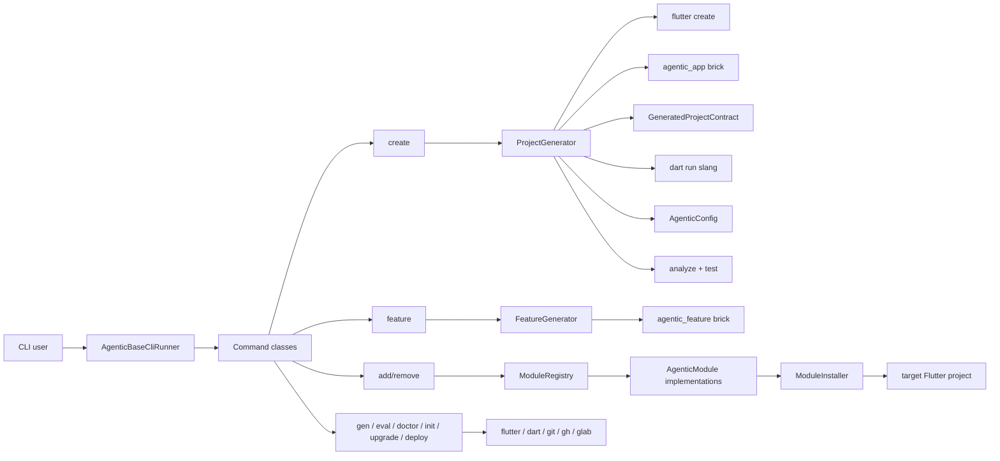

# 04. System Architecture

## Overview

`agentic_base` is a generator package, not an app runtime. The repo architecture centers on a command-line control plane that shells out to Flutter and Dart tooling, applies Mason templates, and mutates target-project files in a controlled way.

## Main Layers

### 1. CLI Layer

Files under `lib/src/cli/` define the user-facing contract:

- `cli_runner.dart` wires the command catalog
- command files validate input, choose the right workflow, and translate failures into exit codes

This layer should stay user-facing and thin, though some command files currently carry too much orchestration.

### 2. Generator Layer

Files under `lib/src/generators/` own scaffold workflows:

- `ProjectGenerator` handles fresh app creation
- `FeatureGenerator` applies feature bricks
- `TestGenerator` turns a feature spec into test stubs

`ProjectGenerator` is the central create-flow orchestrator. It calls native tooling, overlays templates, writes config, installs modules, applies ownership cleanup, materializes typed translations, then verifies the generated project.

### 3. Project State Layer

Files under `lib/src/config/` define repo-managed state:

- `AgenticConfig` reads and writes `.info/agentic.yaml`
- `SpecParser` parses `feature.spec.yaml`
- `StateConfig` maps supported state-management choices to dependencies

This layer is the package memory for generated projects.

### 4. Module Layer

Files under `lib/src/modules/` define installable capabilities:

- `AgenticModule` is the contract
- `ModuleRegistry` is the inventory plus dependency/conflict resolver
- `ModuleInstaller` performs file and YAML mutations
- concrete modules generate service contracts, runtime wiring, and manual platform instructions

Current registry count: 27 modules.

### 5. Template Layer

Mason bricks under `bricks/` hold generated project structure:

- `agentic_app` for whole-app bootstrap
- `agentic_feature` for feature scaffolding

The app brick also carries generated-project documentation and Mason hooks for validation and post-generation dependency install.

## Key Flows

### Create Flow

1. user runs `agentic_base create <project>`
2. CLI validates name, org, platforms, and color input
3. `ProjectGenerator` runs `flutter create`
4. app brick overlays opinionated project files
5. `.info/agentic.yaml` is written with one persisted `ci_provider`
6. selected modules are installed
7. `build_runner` runs for DI/router/model codegen
8. duplicate root shell files and forbidden IDE artifacts are removed
9. `dart run slang` materializes typed localization output from `build.yaml`
10. analyze and tests run on the generated app

### Add Module Flow

1. user runs `agentic_base add <module>`
2. command loads `.info/agentic.yaml`
3. `ModuleRegistry` resolves the module plus transitive prerequisites
4. concrete module writes files and dependency entries through `ModuleInstaller`
5. `flutter pub get` runs
6. `build_runner` plus `dart format` refresh the generated project graph
7. manual platform steps are printed when needed

### Existing Project Init Flow

1. user runs `agentic_base init` inside a Flutter project
2. package detects state-management hints from `pubspec.yaml`
3. `.info/agentic.yaml` is created
4. helper files such as `AGENTS.md`, `CLAUDE.md`, `Makefile`, and scripts are added only if absent

## CI And Operations

Repo CI currently lives in one GitHub Actions workflow:

- [`.github/workflows/ci.yml`](../.github/workflows/ci.yml)

That workflow verifies the package, runs generated-app smoke coverage for both CI providers, and enforces a separate pinned macOS generated-app native gate. Generated-project CI is scaffolded into downstream repos, not executed from this package repo.

## Architectural Pressure Points

- command files are trending large and mix orchestration with reporting
- deployment behavior now depends on one persisted provider contract and provider-specific downstream CI templates
- README and registry inventory must stay in sync as modules change
- generated app provider contracts now exist in two forms and need docs/tests to stay aligned

## References

- [`lib/src/cli/cli_runner.dart`](../lib/src/cli/cli_runner.dart)
- [`lib/src/generators/project_generator.dart`](../lib/src/generators/project_generator.dart)
- [`lib/src/generators/generated_project_contract.dart`](../lib/src/generators/generated_project_contract.dart)
- [`lib/src/generators/feature_generator.dart`](../lib/src/generators/feature_generator.dart)
- [`lib/src/modules/module_registry.dart`](../lib/src/modules/module_registry.dart)
- [`bricks/agentic_app/brick.yaml`](../bricks/agentic_app/brick.yaml)
