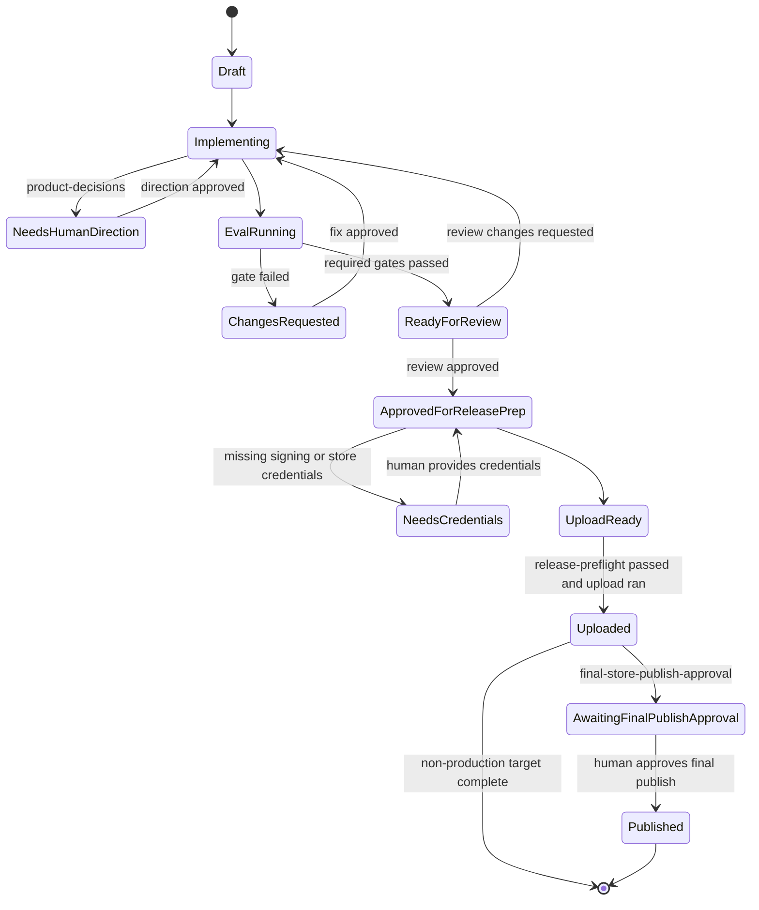

# 12. Approval State Machine

## Scope

Harness Contract V1 makes human approval boundaries explicit.

The point is not to slow agents down. The point is to make the stopping conditions finite, inspectable, and non-negotiable.

Status:

- design target for future implementation waves
- the state model below defines the approval contract to implement; current generated repos still use the simpler checkpoint language already present in `.info/agentic.yaml` and generated release scripts

## State Diagram

## Required Human Pauses

| Pause | Trigger | Reason |
| --- | --- | --- |
| `product-decisions` | Scope, architecture, or provider change with user-visible product impact | Agents should not silently redefine the product. |
| `credential-setup` | Signing, store, backend, or external service credentials are needed | Secrets and account ownership stay human-controlled. |
| `final-store-publish-approval` | App Store or Play production release would become visible to end users | Final publish authority stays human-owned. |

## Optional Human Reviews

Teams may choose extra approvals for:

- staged rollout promotion
- billing or entitlement changes
- large migration waves
- post-incident recovery releases

Those extra approvals are team policy, not part of the universal Harness Contract V1 minimum.

## Allowed Agent Actions By State

| State | Agent May Do |
| --- | --- |
| `Draft` | inspect context, propose changes, prepare implementation |
| `Implementing` | edit generator-owned or project-owned code within scope |
| `EvalRunning` | execute verify and evidence workflows |
| `ReadyForReview` | assemble evidence and summarize residual risk |
| `ApprovedForReleasePrep` | run release-preflight and build/upload preparation |
| `UploadReady` | perform non-final upload actions allowed by the target |
| `Uploaded` | stop unless the target is non-production or a human approves the next step |

## Disallowed Shortcuts

Agents must not:

- skip from `Implementing` to `Uploaded` without required gates
- treat missing credentials as a recoverable automatic step
- treat TestFlight or Play draft upload as equivalent to final production publish
- convert a blocked or skipped gate into a pass by prose alone

## Output Contract

The approval state should be visible in:

- evidence `summary.json`
- release-preflight output
- generated docs that explain release boundaries
- future manifest approval metadata when implementation lands

## References

- [`docs/11-eval-and-evidence-model.md`](./11-eval-and-evidence-model.md)
- [`docs/06-deployment-guide.md`](./06-deployment-guide.md)
- [bricks/agentic_app/__brick__/{{project_name.snakeCase()}}/tools/release-preflight.sh](<../bricks/agentic_app/__brick__/{{project_name.snakeCase()}}/tools/release-preflight.sh>)
- [bricks/agentic_app/__brick__/{{project_name.snakeCase()}}/tools/release.sh](<../bricks/agentic_app/__brick__/{{project_name.snakeCase()}}/tools/release.sh>)
