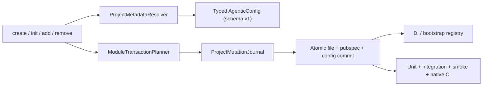

# Research Memo: Init/Create/Module Contract Hardening

Date: 2026-04-10 17:44 Asia/Saigon
Scope: planning guidance only; no repo changes beyond this report

## 1. Executive Summary

Best fit: introduce a typed project metadata layer plus a journaled project-mutation engine, then make `create`, `init`, `add`, and `remove` thin orchestrators over that engine. Keep the good primitives already here: [`yaml_edit`](https://pub.dev/packages/yaml_edit) for comment-preserving YAML edits, [`ModuleRegistry`](/Users/biendh/base/lib/src/modules/module_registry.dart) for dependency graph resolution, [`GeneratedProjectContract`](/Users/biendh/base/lib/src/generators/generated_project_contract.dart) for final starter-app validation, and [`StateConfig`](/Users/biendh/base/lib/src/config/state_config.dart) for state-specific dependency sets. Do not add AST-aware refactors; that is already a stated repo non-goal in [`docs/01-project-overview-pdr.md`](../docs/01-project-overview-pdr.md).

The biggest breakage today is not feature coverage, it is trust: `create` writes config before module work is proven, `ProjectGenerator._installModules()` swallows module failures, `init` guesses metadata with substring scans and hardcoded defaults, and `ModuleInstaller` mutates `.info/agentic.yaml` from inside low-level helpers. The result is partial state on failure and config that can drift from the filesystem.

Recommended contract shape:

1. `init` should infer or accept overrides for `org`, `platforms`, `flavors`, `ci_provider`, and `state_management`, then persist provenance for each field.
2. `create --modules` should install as one transaction, fail fast on any module error, and only finalize config after all mutations succeed.
3. Module install/uninstall should become declarative plans with rollback, not best-effort imperative side effects.
4. Module integration should be structured: DI binding, bootstrap hook, manual platform steps, and test seams are part of the module manifest, not just console text.
5. CI should cover unit, integration, generated-app smoke, native gate, and dependency-downgrade regressions.

## 2. Research Methodology

Sources consulted: 15+ repo-local docs/code/test files, 5 internal plan/report files, and 5 official docs/package pages.

Key search terms: Dart pub dependencies, `yaml_edit` comment preservation, `get_it` startup registration, `injectable` module annotation, GitHub required status checks, Flutter macOS build.

Date range: current repo state from 2026-04-10, plus official docs crawled in April 2026.

## 3. Current Contract Gaps

| Area | Evidence | Why it is unsafe |
| --- | --- | --- |
| `create` module transaction | [`create_command.dart`](../lib/src/cli/commands/create_command.dart#L202-L233), [`project_generator.dart`](../lib/src/generators/project_generator.dart#L95-L183) | module failures are logged and skipped, so create can finish with partial installs |
| `init` metadata inference | [`init_command.dart`](../lib/src/cli/commands/init_command.dart#L51-L90), [`init_command.dart`](../lib/src/cli/commands/init_command.dart#L161-L214) | hardcoded org/platform/flavor defaults and substring search are too weak for retrofits |
| `init` repair behavior | [`init_command.dart`](../lib/src/cli/commands/init_command.dart#L51-L58) | any existing `.info/agentic.yaml` is treated as "done", so missing helper files are not backfilled |
| config integrity | [`module_installer.dart`](../lib/src/modules/module_installer.dart#L139-L159), [`agentic_config.dart`](../lib/src/config/agentic_config.dart#L30-L66) | low-level helpers own config writes, so state can drift from files and pubspec changes |
| dependency determinism | [`module_installer.dart`](../lib/src/modules/module_installer.dart#L22-L46), [`pubspec.yaml`](../pubspec.yaml#L13-L24), [Dart pub dependencies](https://dart.dev/tools/pub/dependencies) | `any` is the default when no version is supplied; that is not deterministic enough for a generator |
| module integration contract | [`base_module.dart`](../lib/src/modules/base_module.dart#L30-L40), [`bricks/agentic_app/__brick__/{{project_name.snakeCase()}}/lib/app/bootstrap.dart`](../bricks/agentic_app/__brick__/{{project_name.snakeCase()}}/lib/app/bootstrap.dart#L10-L30), [`bricks/agentic_app/__brick__/{{project_name.snakeCase()}}/lib/core/di/injection.dart`](../bricks/agentic_app/__brick__/{{project_name.snakeCase()}}/lib/core/di/injection.dart#L1-L8) | DI and bootstrap hooks are implicit, not structured; manual steps are only strings |
| test coverage | [`test/src/cli/commands/init_command_test.dart`](../test/src/cli/commands/init_command_test.dart#L37-L55), [`test/src/modules/module_registry_test.dart`](../test/src/modules/module_registry_test.dart#L4-L242), [`test/integration/generated_app_smoke_test.dart`](../test/integration/generated_app_smoke_test.dart#L16-L65) | there is no `add`/`remove` transaction coverage and no init retrofit fixture coverage |

## 4. Recommended Architecture

### 4.1 Ranked choice

| Rank | Approach | Fit | Risk | Maintenance | Recommendation |
| --- | --- | --- | --- | --- | --- |
| 1 | Declarative module manifests + journaled transaction engine + typed project metadata | Best | Medium | Moderate | Use |
| 2 | Keep imperative install/uninstall, add ad hoc rollback and more guards | Medium | High residual risk | Low upfront, high long-term | Only as a stopgap |
| 3 | Git worktree or repo-snapshot staging for every install | Strong rollback | High operational cost | High | Reject |

The main reason option 1 wins: it matches the repo's current shape. Modules are already isolated by file, `StateConfig` already knows which DI system is active, `ModuleRegistry` already knows graph order, and the app brick already owns bootstrap/DI at a single call site. The missing piece is a shared mutation contract, not a new runtime system.

### 4.2 Metadata inference policy

| Field | Preferred source order | Fallback | Persistence rule |
| --- | --- | --- | --- |
| `state_management` | exact `pubspec.yaml` dependency keys mapped to `StateConfig` | `cubit` | persist `state_management_source` as `pubspec`, `inferred`, or `defaulted` |
| `ci_provider` | exact presence of `.github/workflows` or `.gitlab-ci.yml` / `.gitlab` | `github` | keep current enum, add provenance |
| `platforms` | actual platform directories and native config files | create-default contract only when no evidence exists | infer from filesystem, not from comments |
| `flavors` | flavor entrypoints, `env/*.env.example`, `flavorizr.yaml`, native flavor artifacts | `dev`, `staging`, `prod` only when no evidence exists | never overwrite existing custom flavors |
| `org` | explicit CLI flag, then native bundle/application identifiers | `com.example` | defaulted values must be labeled, not silently assumed |

Important detail: `init` should not just return when `.info/agentic.yaml` already exists. It should validate `schema_version`, backfill missing helper files, and migrate legacy configs. That is how retrofit projects stay safe and repairable.

### 4.3 Contract model

Use a typed config object, not a raw `Map<String, dynamic>`, and add a small schema version:

```text
schema_version: 1
tool_version: <cli version>
project_kind: generated | initialized
metadata_source:
  org: inferred
  platforms: filesystem
  flavors: contract
  ci_provider: explicit
  state_management: pubspec
```

Keep the config small. The goal is provenance and migration safety, not a second database.

### 4.4 Module integration contract

| Concern | Recommended contract | Why |
| --- | --- | --- |
| DI registration | Structured manifest entries that map to `get_it` / `injectable` or Riverpod adapters | the current app brick already uses `configureDependencies()` and startup registration |
| Bootstrap wiring | One generated bootstrap registry called from `bootstrap.dart`, not AST patching | avoids fragile edits to the app shell |
| Manual platform steps | Structured records, persisted in config and rendered into docs | console text is easy to miss and hard to audit |
| Testability | Pure Dart contract tests plus rollback tests for each module plan | keeps modules verifiable without runtime device dependencies |

This fits existing app-brick behavior: `bootstrap()` already centralizes startup and `configureDependencies()` already centralizes DI setup in [`bricks/agentic_app/__brick__/{{project_name.snakeCase()}}/lib/app/bootstrap.dart`](../bricks/agentic_app/__brick__/{{project_name.snakeCase()}}/lib/app/bootstrap.dart#L10-L30) and [`bricks/agentic_app/__brick__/{{project_name.snakeCase()}}/lib/core/di/injection.dart`](../bricks/agentic_app/__brick__/{{project_name.snakeCase()}}/lib/core/di/injection.dart#L1-L8). For `get_it` specifically, the package docs emphasize registration at startup and easy reset for tests, which matches a centralized bootstrap registry. For `injectable`, the package docs explicitly support `@module`, `@lazySingleton`, and async module registration.

### 4.5 Transaction boundary

Use one `ProjectMutationJournal` for each command family:

1. `create`: full project transaction, rollback by deleting the output directory on failure.
2. `init`: limited transaction over `.info/agentic.yaml` plus helper files.
3. `add` / `remove`: module transaction over `pubspec.yaml`, file writes, config updates, and any bootstrap registry updates.

Low-level helpers like `ModuleInstaller` should stop owning config writes. They should only edit files and pubspec content. The final config commit belongs to the transaction executor, after all writes succeed.

### 4.6 Architecture diagram



## 5. Trade-Offs

| Option | Performance | Complexity | Maintenance | Adoption risk | Fit |
| --- | --- | --- | --- | --- | --- |
| Declarative manifests + journaled commit | Good | Medium | Good | Medium, because it touches core commands and modules | Best |
| Imperative install/uninstall + try/catch rollback | Good | Low | Poor over time | High, because config drift still leaks through | Weak stopgap |
| Git worktree staging | Poor to moderate | High | Moderate | High, because it adds git behavior to every mutation path | Overkill |

Version policy trade-off:

| Policy | Determinism | Upgrade cost | Recommendation |
| --- | --- | --- | --- |
| `any` at install time | Low | Low upfront, high hidden cost | Reject |
| Exact pin per package | High | High maintenance | Usually too rigid |
| Central caret-catalog with CI downgrade checks | High enough | Moderate | Use |

The Dart pub docs back this up: caret syntax is a best practice, and the docs explicitly recommend testing downgraded dependencies before publishing. That maps well to a generator that wants stable, reproducible starter projects without freezing every dependency forever.

## 6. CI Verification Strategy

| Gate | Scope | What it catches |
| --- | --- | --- |
| `dart analyze --fatal-infos` | package code | syntax, type, and API regressions |
| `dart test` | package unit tests | resolver, config, registry, and transaction logic |
| `generated_app_smoke_test.dart` | create contract | generated app ownership contract and provider variants |
| macOS native gate | generated app runtime | native flavor, iOS, and platform integration regressions |
| dependency downgrade job | manifest policy | version-catalog drift and over-tight constraints |

Current CI already has the right shape in [`.github/workflows/ci.yml`](../.github/workflows/ci.yml#L1-L64): analyze, test, generated-app smoke, and a pinned macOS native gate. Keep the required jobs unconditional. If you add path filters, use them only for non-required helper jobs, not for the required gate. GitHub's protected-branch docs say required status checks must reach a terminal success-like state before merging.

Verification additions I would prioritize:

1. `init` fixture tests for existing projects with GitHub, GitLab, mixed or missing platform folders, and legacy `.info/agentic.yaml`.
2. `create --modules` tests that force a failing module after the first file write, then assert rollback and no partial config.
3. `add` and `remove` round-trip tests with prerequisite chains and dependency conflicts.
4. A version-policy test that rejects `any` in module dependency declarations.
5. A generated-project smoke test that confirms config provenance and metadata source fields survive create and init.

## 7. File Groups Affected

| Group | Examples | Why it changes |
| --- | --- | --- |
| CLI commands | `lib/src/cli/commands/init_command.dart`, `create_command.dart`, `add_command.dart`, `remove_command.dart` | shared resolver and transaction orchestration |
| Config layer | `lib/src/config/agentic_config.dart`, `ci_provider.dart`, `state_config.dart` | typed schema, provenance, and state-aware inference |
| Module layer | `lib/src/modules/base_module.dart`, `module_installer.dart`, `module_registry.dart`, all module implementations | declarative manifest, version catalog, rollback, bootstrap/test hooks |
| Generators | `lib/src/generators/project_generator.dart`, `generated_project_contract.dart` | commit timing and validation remain canonical |
| App brick | `bricks/agentic_app/__brick__/.../lib/app/bootstrap.dart`, `lib/core/di/injection.dart`, `docs/01-architecture.md` | bootstrap registry and DI wiring contract |
| Tests | `test/src/cli/commands/*`, `test/src/modules/*`, `test/integration/*` | missing transaction, init, and rollback coverage |
| CI/docs | `.github/workflows/ci.yml`, `README.md`, `docs/*.md` | contract, flags, and verification docs must stay truthful |

## 8. Proposed Phase Breakdown

| Phase | Goal | Exit criteria | Primary files |
| --- | --- | --- | --- |
| 1. Typed metadata + schema | Add `schema_version`, provenance, and a typed project-state model | `init` and `deploy` can read legacy and new configs without guesswork | `agentic_config.dart`, `ci_provider.dart`, `state_config.dart`, `init_command.dart` |
| 2. Module manifest + version catalog | Replace `any` with declared constraints and add module metadata records | every module exposes deterministic deps, manual steps, and bootstrap hooks | `base_module.dart`, `module_registry.dart`, module files |
| 3. Transaction engine | Journal mutations and make failures roll back cleanly | `create`, `init`, `add`, and `remove` leave no partial config or half-installed module on failure | `module_installer.dart`, `project_generator.dart`, command files |
| 4. Bootstrap and DI integration | Generate state-aware bindings without AST rewriting | bootstrap registry is additive, testable, and state-system aware | app brick `bootstrap.dart`, `injection.dart`, generated module helpers |
| 5. CI, fixtures, and docs | Close the loop with tests and updated docs | failures in metadata, module rollback, or dependency policy are caught before merge | `test/**`, `.github/workflows/ci.yml`, `README.md`, `docs/**` |

Recommended ordering: phases 1 and 2 first, because the transaction engine and CI tests need a stable contract to assert against. Phase 4 should follow phase 3, not precede it.

## 9. Sources

| Type | Source | Why it matters |
| --- | --- | --- |
| Repo docs | [`README.md`](../README.md), [`docs/01-project-overview-pdr.md`](../docs/01-project-overview-pdr.md), [`docs/03-code-standards.md`](../docs/03-code-standards.md), [`docs/04-system-architecture.md`](../docs/04-system-architecture.md), [`docs/06-deployment-guide.md`](../docs/06-deployment-guide.md) | defines the current product contract and non-goals |
| Repo code | [`init_command.dart`](../lib/src/cli/commands/init_command.dart), [`create_command.dart`](../lib/src/cli/commands/create_command.dart), [`add_command.dart`](../lib/src/cli/commands/add_command.dart), [`remove_command.dart`](../lib/src/cli/commands/remove_command.dart), [`module_installer.dart`](../lib/src/modules/module_installer.dart), [`module_registry.dart`](../lib/src/modules/module_registry.dart), [`agentic_config.dart`](../lib/src/config/agentic_config.dart), [`state_config.dart`](../lib/src/config/state_config.dart), [`generated_project_contract.dart`](../lib/src/generators/generated_project_contract.dart) | shows the current contract gaps and the parts worth preserving |
| Repo tests | [`test/src/cli/commands/init_command_test.dart`](../test/src/cli/commands/init_command_test.dart), [`test/src/modules/module_registry_test.dart`](../test/src/modules/module_registry_test.dart), [`test/integration/generated_app_smoke_test.dart`](../test/integration/generated_app_smoke_test.dart) | shows current coverage and what is missing |
| Official docs | [Dart pub dependencies](https://dart.dev/tools/pub/dependencies), [yaml_edit](https://pub.dev/packages/yaml_edit), [get_it](https://pub.dev/packages/get_it), [injectable](https://pub.dev/packages/injectable), [GitHub protected branches](https://docs.github.com/en/repositories/configuring-branches-and-merges-in-your-repository/managing-protected-branches/about-protected-branches), [Flutter macOS deployment](https://docs.flutter.dev/deployment/macos) | supports the dependency, DI, and CI recommendations |
| Internal research | [`plans/reports/researcher-260410-1041-gitlab-macos-runner-gate.md`](./researcher-260410-1041-gitlab-macos-runner-gate.md), [`plans/reports/researcher-260410-1044-github-macos-native-gate.md`](./researcher-260410-1044-github-macos-native-gate.md) | backs the CI/native-gate recommendation already chosen in this repo |

## 10. Limitations

I did not inspect every module implementation line-by-line for platform-specific bootstrap quirks. I also did not run the CLI or the tests; this memo is research-only. Riverpod-specific provider generation is only covered here at the contract level, because the current generated app brick and docs are centered on `get_it`/`injectable`.

## 11. Unresolved Questions

1. Should `init` default ambiguous metadata and continue, or fail and ask for explicit values when evidence is weak?
2. Should the bootstrap registry be a generated plain Dart file or a generated include list in `bootstrap.dart`?
3. Should the dependency catalog live in code or in a small YAML manifest that module code reads at build time?

**Status:** DONE_WITH_CONCERNS
**Summary:** Proposed a contract-first refactor centered on typed metadata, journaled module transactions, structured DI/bootstrap hooks, deterministic dependency versions, and CI fixtures that cover create/init/add/remove plus downgrade and native gates.
**Concerns/Blockers:** Report only; no code changed. The main open decision is how strict `init` should be when metadata evidence is ambiguous.
